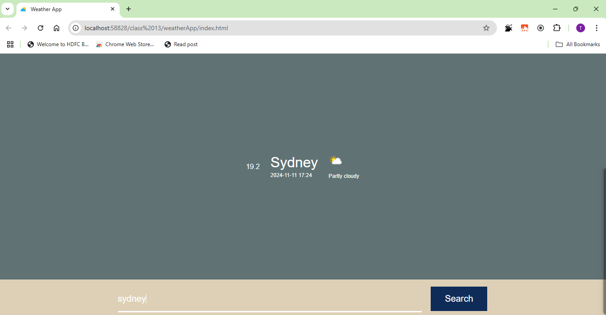

# Weather App

A simple and responsive weather application that allows users to search for weather information of any city. The app fetches real-time weather data from WeatherAPI and displays essential weather details including temperature, location, date/time, and weather conditions with corresponding icons.

## Features

- **City Search**: Users can search for any city worldwide
- **Real-time Weather Data**: Displays current weather information using WeatherAPI
- **Weather Details**:
  - Current temperature
  - Location name
  - Date and time
  - Weather condition with descriptive icon
- **Responsive Design**: Works seamlessly across desktop and mobile devices

## Technologies Used

- HTML5
- CSS3
- JavaScript (Vanilla)
- WeatherAPI

## Setup and Installation

1. Clone the repository
```bash
git clone https://github.com/yourusername/weather-app.git
```

2. Navigate to the project directory
```bash
cd weather-app
```

3. Get your API key
- Sign up at [WeatherAPI](https://www.weatherapi.com/)
- Get your free API key
- Replace `YOUR_API_KEY` in the JavaScript file with your actual API key

4. Open the project
- Open `index.html` in your preferred browser
- Or use a local development server

## Usage

1. Enter the name of a city in the search box
2. Click the search button or press Enter
3. View the displayed weather information:
   - Temperature
   - City name
   - Current date and time
   - Weather condition with icon

## Screenshots

[]

## API Reference

This project uses the [WeatherAPI](https://www.weatherapi.com/) to fetch weather data. The free tier includes:

- Real-time weather data
- Weather icons
- Location data
- Date and time information

## Contributing

1. Fork the project
2. Create your feature branch (`git checkout -b feature/AmazingFeature`)
3. Commit your changes (`git commit -m 'Add some AmazingFeature'`)
4. Push to the branch (`git push origin feature/AmazingFeature`)
5. Open a Pull Request

## License

This project is licensed under the MIT License - see the [LICENSE.md](LICENSE.md) file for details

## Acknowledgments

- Weather data provided by [WeatherAPI](https://www.weatherapi.com/)
- Weather icons from WeatherAPI's collection

## Contact

Your Name - [tharunbalaji110@gmail.com](tharunbalaji110@gmail.com)

Project Link: [https://github.com/tharunbalaji110/weather-app](https://tharun-balaji.github.io/weather-app/)